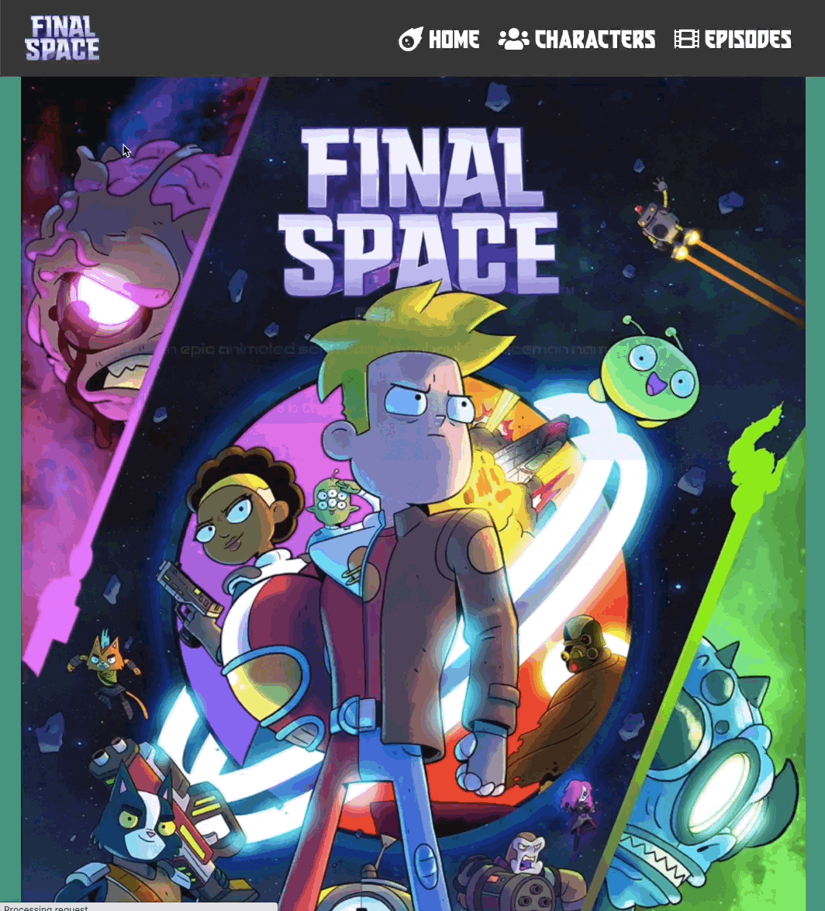
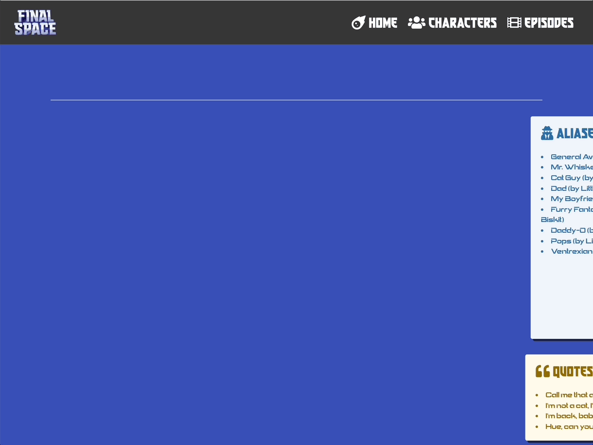
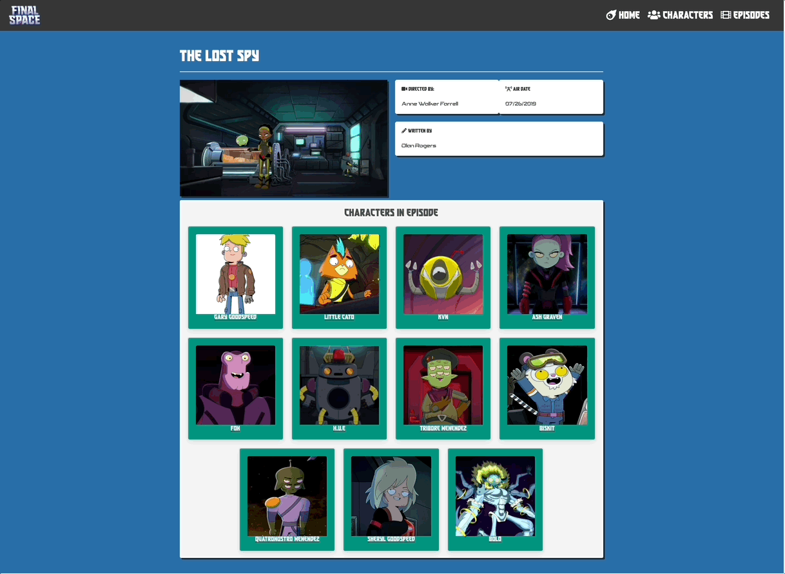

# Final Space

## Overview



This project was a 2-day paired hackathon to create a React application that consumes a public API. It was my second project as a GA student, and I worked with [Gayatri Rajgor](https://github.com/gayatrirajgor).

https://final-space-info.netlify.app/


## Brief

Create a React application with multiple components that consumes a public API.

## Technologies used
* React.js
* React Router
* HTML5
* CSS3
* Bulma
* FontAwesome
* Git & GitHub
* Insomnia
* Axios
* Animate CSS
* Final Space API


## Approach
We chose to use the Final Space API to showcase information about the TV series Final Space. As the API had endpoints for episodes and characters, we decided to showcase an index of both as well as detail pages for the individual elements.

### Planning
As it was our first React app, we decided to go with a relatively simple design, and one aimed at reusing components - particularly in the index pages. We jointly wrote a bit of pseudocode, and decided we would pair code throughout the day, and then before breaking for the night would take a different component to work on overnight before merging all the code the next morning. In practice, we were very productive during the day and there was not a huge amount that was left for us to work on alone.
 
### Index Pages
We used axios get requests to retrieve all characters and episodes for their respective index pages, and then used an array map to pass each element to a child card component to render each card as a link to a detail page.


```javascript 
filteredCharacters.map((character,index)=> {
             return (
               <CharacterCard
                 value={character}
                 key={index}
                 item='characters'
               />
             )
           })
 
<div className='columns is-multiline'>
         {episodeArray.map((episode,index)=> {
           return (
             <CharacterCard
               value={episode}
               key={index}
               item='episodes'
             />
           )
         })}
       </div>

<Link to={`/${item}/${value.id}`}>
       <div className='card animate__animated animate__headShake'>
         <div className='card-image'>
           <figure className={`image ${item === 'characters' ? 'is-square' : 'is-2by1' }`}>
             
           </figure>
         </div>
         <div className='card-header'>
           <div className='card-header-title has-background-dark is-centered'>
             <p className='title is-5 has-text-white'>{value.name}</p>
           </div>
         </div>
       </div>
     </Link>
```
### Detail Pages

We took a similar approach with the detail pages, where we would utilize a useEffect to run our axios request to the API, and pass the values into a child component for rendering. For instance, we wanted to showcase each characters’ notable quotes, but the API did not have a filtered quote endpoint. So in the initial detail component, we ran the get request to grab the individual character info as well as all quotes, and then passed both objects to the child component where we filtered the quotes and rendered the character information together.



```javascript

useEffect(() => {
   const getData = async () => {
     try {
       const { data } = await axios.get(`https://finalspaceapi.com/api/v0/character/${id}`)
       setCharacter(data)
     } catch (error) {
       console.log(error)
     }
   }
   const getQuotes = async () => {
     try {
       const { data } = await axios.get('https://finalspaceapi.com/api/v0/quote')
       setQuotes(data)
     } catch (error) {
       console.log(error)
     }
   }
   getData()
   getQuotes()
 }, [id])
 
 return (
   <>
     <section className='section has-background-link-dark' id='character-detail'>
       <div className='container'>
         {character ?
           <CharacterTiles
             character={character}
             quotes={quotes}
           />
           :
           <p><I className='fa-solid fa-hourglass'></I>…Loading</p>
         }
       </div>
     </section>
   </>
 )
               <div className='tile is-child notification is-danger is-light'>
                 <p className='title has-text-weight-normal'><I className='fas fa-trophy'></I> Abilities</p>
                 {character.abilities.map((ability,index)=>{
                   return (
                     <li key={index}>{ability}</li>
                   )
                 })}
               </div>
                /* */
           <div className='tile is-parent'>
             <div className='tile is-child notification is-warning is-light'>
               <p className='title has-text-weight-normal'><I className='fas fa-quote-left'></I> Quotes <I className='fas fa-quote-right'></I></p>
               {quotes.filter(quote => quote.by === character.name).map((quote,index)=> {
                 return (
                   <li key={index}>{quote.quote}</li>
                 )
               })}
             </div>
```
We had to alter our approach for the episode detail, since featured characters’ ids were returned by the API, so we had to pop each out of the data array and pass it into the map function and then do the get request from within the child component as well, rather than just the markup.


```jsx
<div className='columns is-multiline is-justify-content-center'>
                     {episode.characters.map((url,index)=> {
                       const address = url.split(‘/‘).pop()
                       return (
                         <CharacterLink
                           key={index}
                           address={address}
                           url={url}
                         /> 
                       )
                     })}
                   </div>
```
## Wins & Challenges

### Wins
* Using React for the first time and getting a finished app completed in 2 days
* Using state on the character index page and implementing a text search feature

### Challenges
* Bulma as a CSS framework took some getting used to, and the amount of markup required was an additional challenge for us.

## Key Learnings:
* Pair Coding - working together provided many opportunities to see alternative approaches/preferences to solving problems, and I think both of us benefitted from each other in this regard. 
* React - At the start our comfort level with the framework was pretty shaky, however as we worked on something a bit larger scale than we had before (particularly given the timeframe) the benefits became apparent, particularly with being able to re-use components, and conditionally render different states based on props.

## Future Features:
* Additional filtering options, perhaps as an offcanvas panel rather than permanently displayed
* Better mobile responsiveness
